# TaskRouter, drawn

The same reasoning as [design.md](design.md), in diagrams. That document is the prose and
the authority; this one is for orienting quickly or for reviewing the shape of the thing.

Throughout, a consistent distinction: **amber is owned by the engine** — it decides this and a
host cannot override it — and **teal is owned by the host** — the engine cannot know it and
will ask. Nearly every question about this library resolves to which side of that line
something falls on.

---

## The four packages

Split so a host takes only what it needs. The dependency direction is strict and one-way.

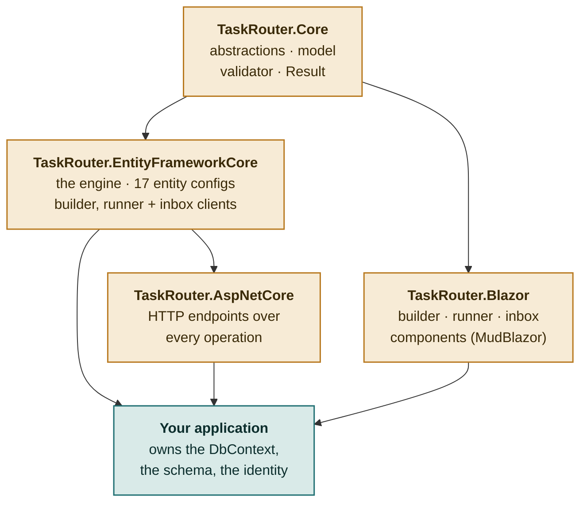

**Note the shape.** `TaskRouter.Blazor` depends on `Core` only — never on EF. That is what
lets the same components run in a browser, where there is no DbContext at all.

---

## The data model

Seventeen tables, all prefixed `TaskRouter*`. They live in *your* database, created by *your*
migrations — the engine has no database of its own, which is what lets a task completion and a
domain update commit in one transaction.

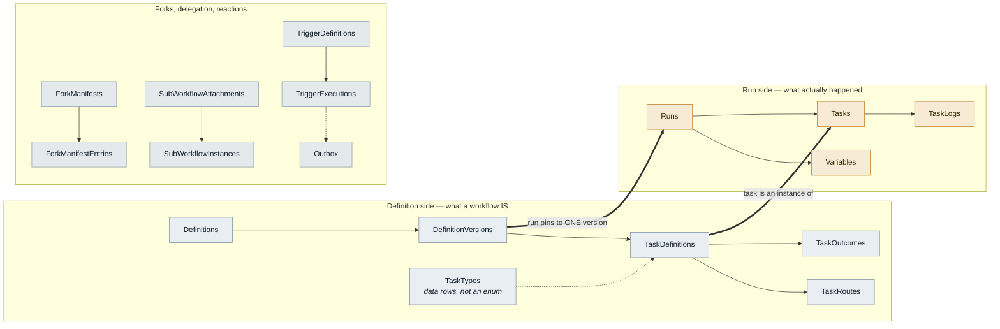

**The two heavy arrows are the whole model.** A run pins to one version and never moves; a
task is an instance of a task *definition*. Everything else hangs off those two facts.

---

## Routes target definitions, not types

The single decision the rest of the design rests on. A route says "when *this step* ends with
*this outcome*, go to *that step*" — not "when any Technical Review is approved". So one
workflow may contain the same task type more than once, routing differently each time.

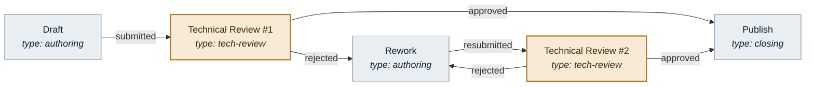

The two amber steps share a task type and route differently. An engine keying routing on a
task-type enum cannot express this — and therefore cannot express reusable sub-workflows
either, since a sub-workflow is the same shape appearing in more than one place.

---

## How a run advances

There is no scheduler and no interpreter loop. A run moves **only** when someone completes a
task, and completing a task is one transaction that does all of this or none of it.

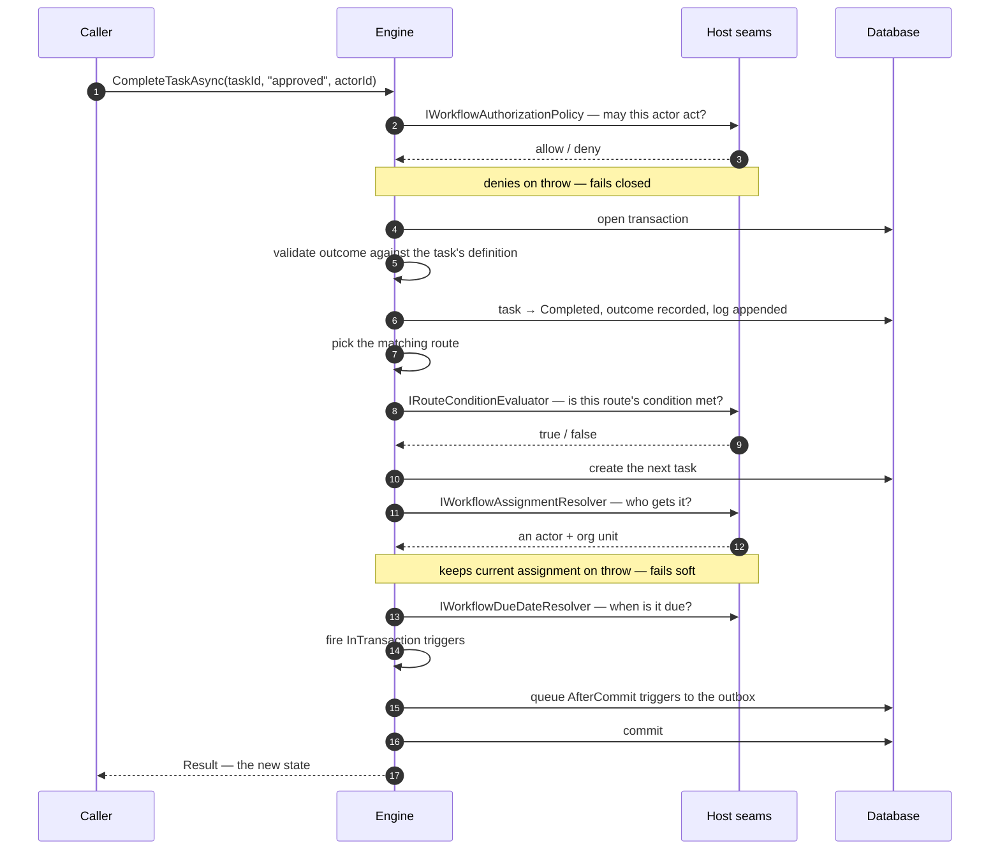

**Every host call is inside the transaction.** A seam that is slow makes the transaction slow,
which is a real constraint on what belongs in one — the outbox exists precisely so anything
talking to the outside world happens after the commit instead.

> **The engine owns task status.** No API accepts a caller-supplied status. Callers supply an
> *outcome*; the engine derives status, routing, blocking checks and triggers from it. That is
> what makes those impossible to bypass — there is no back door that sets a task to Completed
> without the routing running.

---

## Versions and pinning

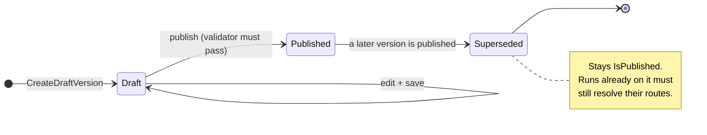

**Superseding is not unpublishing.** A superseded version keeps its published flag, because
runs pinned to it still need to route; only `IsLatest` moves. So editing a workflow can never
reroute work already in flight, and "which version did this run follow?" is one column.

---

## Forks and convergence

Split a step into parallel branches across org units, then bring them back — and when they
converge, send *only some* branches back for rework.

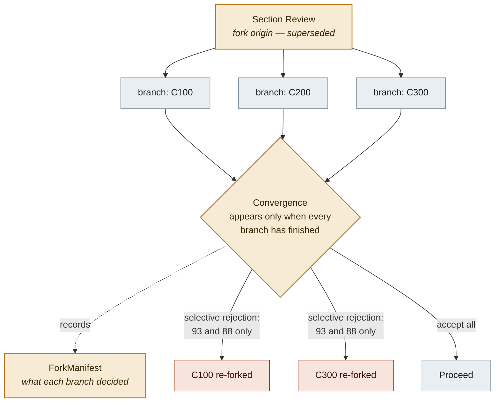

**Selective rejection is a separate operation on purpose.** The engine refuses a rejection
outcome through the ordinary completion path, because it has no way to know *which* branches
were the problem — and re-forking all of them would discard work already accepted.

A **branch key is an opaque string**. In one host it is a section code, in another a region or
a team; the fork logic is identical either way.

---

## What the host owns

Eleven interfaces, but the count is misleading: `AddTaskRouter()` registers a working default
for every one it can.

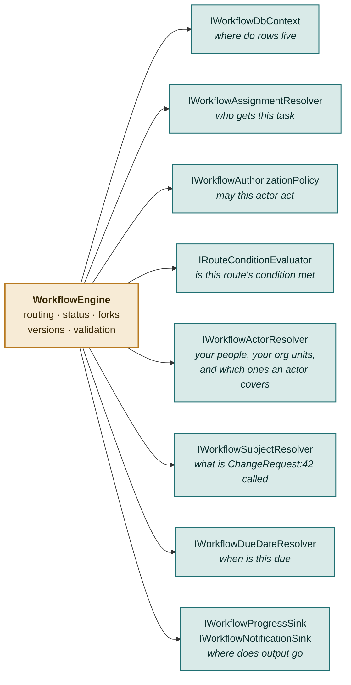

Read this as a list of **questions the engine cannot answer**. Each seam exists because
something is genuinely unknowable from inside a general library, not because the design wanted
to be extensible.

### Where the line falls — a worked example

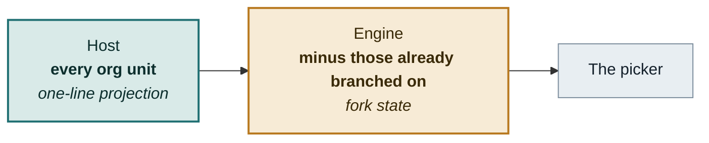

Splitting it here means the host writes something it cannot get wrong. Asking the host for
"the units still available" would oblige every host to reimplement a rule the engine enforces
anyway — and one it would throw over at fork time when they got it wrong.

---

## How each seam fails

Three policies, and the asymmetry is deliberate rather than inconsistent.

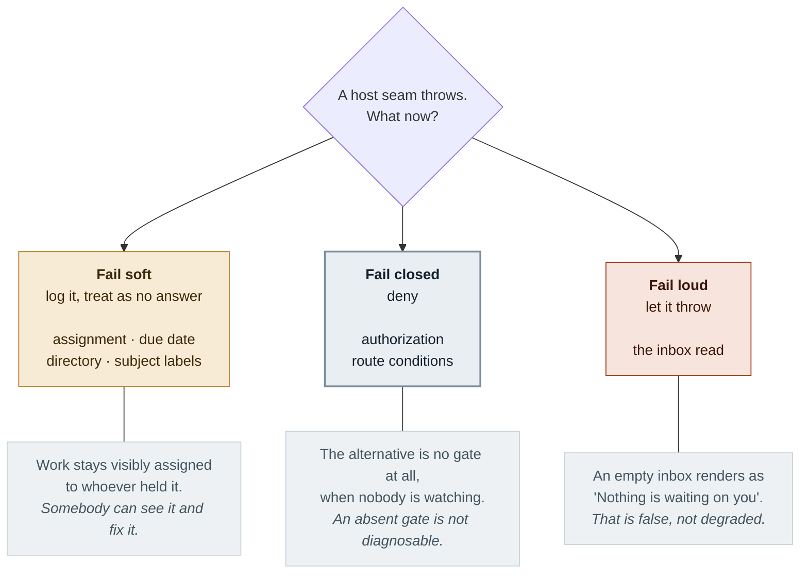

A *lesser* answer is diagnosable — somebody sees the wrong assignee and fixes it. An *absent
gate* is not, and a *false* answer is not. Each seam is placed by asking which kind of wrong
its failure produces.

---

## Triggers and the outbox

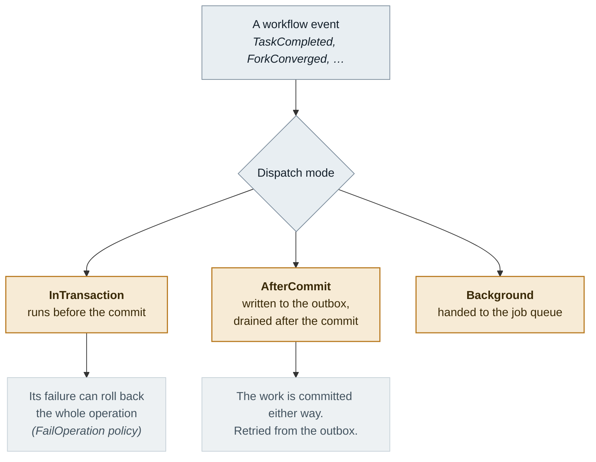

**Rule of thumb: anything that talks to the outside world is AfterCommit.** A webhook inside
the transaction holds a database lock open for an HTTP call to somebody else's server — and
rolls back a completed task if their server is down.

---

## Two hosting models

The Blazor components talk to three seams — builder, runner, inbox. **The library implements
all three twice**, and the choice is your hosting model. Getting it wrong is not a compile
error, which is why it is worth a diagram.

```mermaid
flowchart TB
  subgraph SRV ["Blazor Server — a DbContext in the same process"]
    direction LR
    C1["Components"] --> I1["IWorkflowRunnerClient"] --> E1["EfWorkflowRunnerClient"] --> DB1[("Database")]
  end

  subgraph WASM ["Blazor WebAssembly — a browser, so no DbContext at all"]
    direction LR
    C2["Components<br/><i>identical</i>"] --> I2["IWorkflowRunnerClient"] --> H2["HttpWorkflowRunnerClient"]
    H2 -->|HTTP| EP["/workflow/runner/*"] --> E2["EfWorkflowRunnerClient"] --> DB2[("Database")]
  end

  classDef ui fill:#E8EEF2,stroke:#7B8C9C,color:#14202B
  classDef seam fill:#D9EAE8,stroke:#1F6F72,stroke-width:1.5px,color:#0C2E2D
  classDef eng fill:#F7EBD6,stroke:#B8791F,stroke-width:1.5px,color:#3A2A08
  classDef db fill:#DDE5EA,stroke:#5A6B7A,color:#14202B
  class C1,C2 ui
  class I1,I2 seam
  class E1,E2,H2,EP eng
  class DB1,DB2 db
```

The components are identical in both. Only the implementation behind the seam changes — which
is why the same runner drives both the builder's "Try it" pane and a real document page.

### What a host supplies either way

| Supply | Because | If you skip it |
|---|---|---|
| `AssignmentRoles` | Role keys are opaque, so the engine cannot enumerate them | Authors get no "who does this go to" choices |
| `IWorkflowEditorActorAccessor` | Every workflow edit is attributed to somebody | **Throws.** A placeholder would attribute every edit to a fiction |
| `IWorkflowActorResolver` | Who your people are, what your org units are | Empty pickers, one log line |
| `IWorkflowSubjectResolver` | What `ChangeRequest:42` is called | Raw keys in the inbox, no links |

> **A trap worth knowing.** Any minimal-API handler taking a library interface **must** mark it
> `[FromServices]`. Without it an unregistered type is inferred as a *body* parameter, a GET
> may not have one, and the whole application fails to start with an error naming neither the
> service nor the route. There is a regression test for each endpoint group.

---

## What is deliberately absent

| Not here | Why |
|---|---|
| A user or org model | Every host has one and none agree. Opaque ids plus a directory seam. |
| Its own database | Atomicity with the host's own writes is worth more than isolation. |
| A DSL or code-defined workflows | Customers author their own processes through the builder without a deployment. |
| A status setter | Would make routing, blocking and triggers bypassable. |
| Read authorization | Reads are not gated; the host decides what its screens show. Writes are. |
| **Timers** | The one roadmap item still unbuilt. Distinct from a deadline — a deadline nags a human, a timer moves the run itself. |
